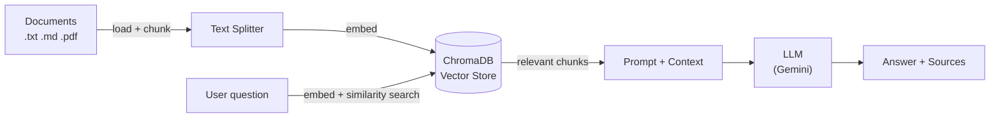

# RAG Question Answering System

A Retrieval-Augmented Generation (RAG) question answering system built with **LangChain**, **FastAPI**, and **ChromaDB**. Ingest your own documents and query them through an LLM whose answers are grounded on retrieved context, with source attribution.

The LLM and embedding providers are pluggable: it runs on **Google Gemini** out of the box (free tier, no credit card required) and can switch to a fully local stack (**Ollama** + HuggingFace) by changing a couple of values in `.env`.

## Features

- **Document ingestion** for `.txt`, `.md`, and `.pdf` files (single file or whole folders).
- **Semantic retrieval** over a persistent ChromaDB vector store.
- **Grounded answers** with source attribution (file name and page for PDFs).
- **Pluggable providers** — Gemini (default) or local Ollama / HuggingFace, selected via configuration.
- **REST API** built with FastAPI, including interactive Swagger docs.
- **CLI** for bulk ingestion.
- **Centralized, validated configuration** via Pydantic Settings.

## Architecture



**Indexing path:** documents are loaded, split into overlapping chunks, embedded, and stored in ChromaDB.
**Query path:** the question is embedded, the most relevant chunks are retrieved, injected into the prompt as context, and the LLM produces an answer constrained to that context.

## Tech stack

| Layer | Technology |
| --- | --- |
| API | FastAPI + Uvicorn |
| RAG orchestration | LangChain (LCEL) |
| Vector store | ChromaDB |
| LLM / embeddings | Google Gemini (default), Ollama / HuggingFace (optional) |
| Configuration | Pydantic Settings |

## Project structure

```
question-answer-by-rag/
├── app/
│   ├── config.py            # Centralized settings (env-driven)
│   ├── schemas.py           # Pydantic request/response models
│   ├── main.py              # FastAPI app and endpoints
│   └── rag/
│       ├── providers.py     # LLM + embedding factories (pluggable)
│       ├── vectorstore.py   # Persistent ChromaDB setup
│       ├── ingest.py        # Load → chunk → embed → store pipeline
│       └── chain.py         # LCEL RAG chain (retrieve → prompt → LLM)
├── scripts/
│   └── ingest.py            # CLI for bulk ingestion
├── sample_docs/             # Example documents
├── data/chroma/             # Vector store (gitignored)
├── requirements.txt
└── .env.example
```

## Getting started

### Prerequisites

- Python 3.11+
- A free Google Gemini API key — create one at [aistudio.google.com](https://aistudio.google.com) (no credit card required)

### Installation

```bash
# Clone the repository
git clone https://github.com/<your-username>/question-answer-by-rag.git
cd question-answer-by-rag

# Create and activate a virtual environment
python -m venv .venv
source .venv/bin/activate          # Windows: .venv\Scripts\Activate.ps1

# Install dependencies
pip install -r requirements.txt
```

### Configuration

```bash
cp .env.example .env
```

Then open `.env` and set your API key:

```
GOOGLE_API_KEY=your-key-here
```

## Usage

### 1. Start the API

```bash
uvicorn app.main:app --reload
```

The interactive API documentation is available at **http://localhost:8000/docs**.

### 2. Ingest documents

Via the CLI:

```bash
python scripts/ingest.py sample_docs
```

Or via the API (`POST /ingest`) by uploading files through Swagger UI.

### 3. Ask a question

```bash
curl -X POST http://localhost:8000/query \
  -H "Content-Type: application/json" \
  -d '{"question": "What is Retrieval-Augmented Generation?"}'
```

Example response:

```json
{
  "answer": "Retrieval-Augmented Generation combines information retrieval with text generation, grounding answers in retrieved documents to reduce hallucinations.",
  "sources": [
    { "content": "...", "source": "rag_intro.txt", "page": null }
  ]
}
```

## API endpoints

| Method | Endpoint | Description |
| --- | --- | --- |
| `GET` | `/health` | Service status and active provider/model |
| `POST` | `/ingest` | Upload and index one or more documents |
| `POST` | `/query` | Ask a question and get an answer with sources |

## Configuration reference

All settings are read from `.env`:

| Variable | Default | Description |
| --- | --- | --- |
| `LLM_PROVIDER` | `gemini` | LLM backend: `gemini` or `ollama` |
| `LLM_MODEL` | `gemini-2.5-flash` | Chat model name |
| `LLM_TEMPERATURE` | `0.1` | Sampling temperature |
| `EMBEDDING_PROVIDER` | `gemini` | Embedding backend: `gemini` or `huggingface` |
| `EMBEDDING_MODEL` | `gemini-embedding-001` | Embedding model name |
| `GOOGLE_API_KEY` | — | Required when using Gemini |
| `CHROMA_DIR` | `./data/chroma` | Vector store directory |
| `COLLECTION_NAME` | `rag_documents` | Chroma collection name |
| `CHUNK_SIZE` | `1000` | Characters per chunk |
| `CHUNK_OVERLAP` | `150` | Overlap between chunks |
| `RETRIEVAL_K` | `4` | Number of chunks retrieved per query |

## Running fully local (no API key)

To run without any cloud provider, use Ollama and local embeddings:

1. Install [Ollama](https://ollama.com) and pull a model, e.g. `ollama pull llama3.2`.
2. Uncomment the optional dependencies in `requirements.txt` and reinstall.
3. Update `.env`:

   ```
   LLM_PROVIDER=ollama
   LLM_MODEL=llama3.2
   EMBEDDING_PROVIDER=huggingface
   EMBEDDING_MODEL=sentence-transformers/all-MiniLM-L6-v2
   ```

No code changes are required — the provider factories handle the rest.

## Roadmap

- [ ] Web frontend (Next.js + React)
- [ ] Dockerized deployment
- [ ] Automated tests
